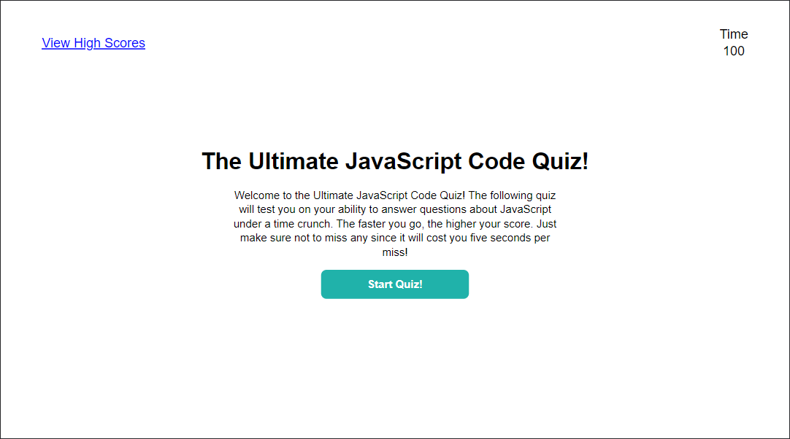

# the-ultimate-js-code-quiz

## Description

This is a JavaScript quiz game that tests your knowledge on basic JavaScript questions. It is timed, with 10 seconds given per question in the array.

The pages are all built and hidden, while the content is dynamically rendered, mostly using querySelector and basic loops.

When a question is answered, a sound is played, which differs depending on if the answer was correct or incorrect. If incorrect, the remaining time goes down by five seconds.

When time runs out or you finish the quiz, the time remaining is taken as your final score. You then give you initials. If you score is one of the top five scores, it is added to the high scores list, along with your initials and the accuracy of your run.

It utilizes local storage to save high scores across plays.

It is deployed at: https://spencerhulse.github.io/the-ultimate-js-code-quiz/
